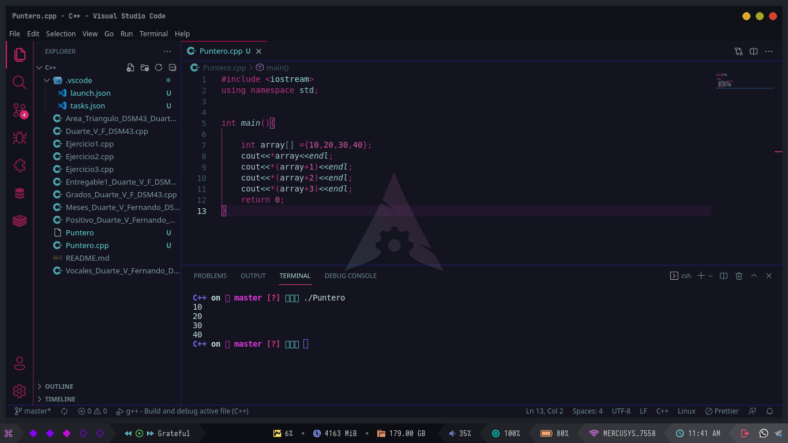

## Investigacion de que es un puntero.
### Elaborado por Fernando Duarte Villavicencio del DSM43.
#### Universidad Tecnologica del Valle de Toluca.

## ¿Que es un puntero?

En ciencias de la computación, un puntero es un objeto del lenguaje de
programación, cuyo valor se refiere a (o "apunta a") otro valor almacenado en otra
parte de la memoria del ordenador utilizando su dirección. Un puntero referencia a
una ubicación en memoria, y a la obtención del valor almacenado en esa ubicación
se la conoce como desreferenciación del puntero.

Ejemplo de Puntero en Go

>` package main`
>
>`import ( "fmt")`
>
>`func Increase(v int) { v++}`
>
>`func main() {`
>
>`var v int = 19`
>
>`Increase(v)`
>
>`fmt.Println("El valor de v es:", v) }`

Contenido extraido de [¿Qué son los punteros en Go?](https://ed.team/blog/que-son-los-punteros-en-go)

Ejemplo de un [Puntero](Puntero.cpp)

Resultado de [Puntero en C++](Puntero.cpp)
